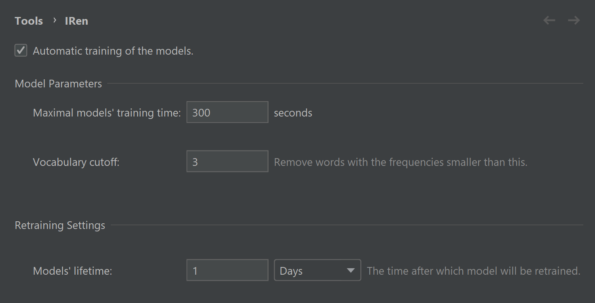

# IRen

## Description

This tool replaces default IDE refactoring with the new one
that will recommend you better variable names with the help of Machine Learning methods.

To suggest consistent names IRen model has to train on a project in which you are currently working.
By the default IRen plugin automatically trains/loads model on a startup of the opened project. 
If you want to manually control it you can switch off the corresponding option in the settings
**Tools | IRen** and launch training by yourself clicking **Refactor | Train IRen Model**.
Also in the settings you can tune some hyperparameters of the model.

IRen inspection helps with maintenance of the code and marks all variables which names are not good enough.

## Installation

1. [Download](https://plugins.jetbrains.com/plugin/15432-iren/versions) latest version
2. Install it manually `Preferences` > `Plugins` > `Install plugin from disk...`

## Features

- Enhanced in-place refactoring via `Shift+F6`. IRen suggestions are shown with probabilities, default ones – without.

- An inspection that highlights bad variable names

- After installing the plugin it asks whether you want IRen to learn naming patterns from your projects automatically
- Also, there is an action that trains models `Refactor` > `Train IRen model` (`Ctrl+Alt+Shift+Z`)

- You can tweak some parameters in `Settings` > `Tools` > `IRen`

## Structure

### Modules:

- `plugin` module contains plugin itself
- `experiments` module contains all experiments that were made

### Directories of `plugin`:

- `org.jetbrains.id.names.suggesting` – part of a plugin that predicts variable names. Done by Igor Davidenko.
- `org.jetbrains.astrid` – part of a plugin that predicts method names. Done by Zarina Kurbatova.

