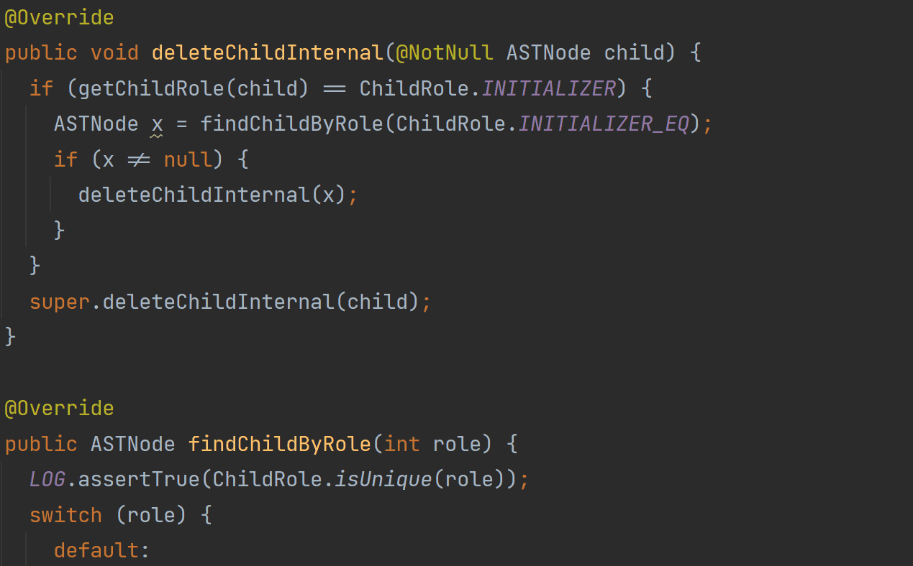
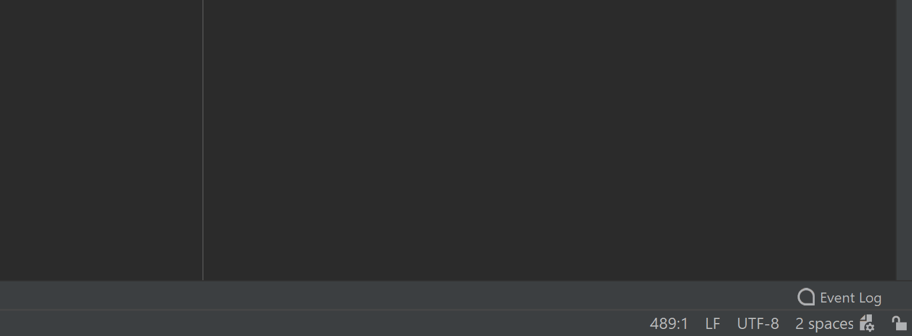

# IRen

## Description

This tool replaces default IDE refactoring with the new one
that will recommend you better variable names with the help of Machine Learning methods.

To suggest consistent names IRen model has to train on a project in which you are currently working.
By the default IRen plugin automatically trains/loads model on a startup of the opened project. 
If you want to manually control it you can switch off the corresponding option in the settings
**Tools | IRen** and launch training by yourself clicking **Refactor | Train IRen Model**.
Also in the settings you can tune some hyperparameters of the model.

IRen inspection helps with maintenance of the code and marks all variables which names are not good enough.

## Supported languages

- Java
- Kotlin
- Python

## Installation

1. Download the plugin from the marketplace. Just type `IRen` in the search bar.

### Issue Tracker
You can file a bug in the [GitHub issue tracker](https://github.com/JetBrains-Research/IRen/issues).

## Features

- Enhanced in-place refactoring via `Shift+F6`.  In contrast to the default ones, IRen suggestions have probabilities on the right.

- An inspection that highlights bad variable names

- After installing the plugin it asks whether you want IRen to learn naming patterns from your projects automatically
- Also, there is an action that trains models `Refactor` > `Train IRen Model` (`Ctrl+Alt+Shift+Z`)

- You can tweak some parameters in `Settings` > `Tools` > `IRen`

- If you are working with the `IntelliJ` repository, the plugin will download the models from the server. You don’t have to train anything!

## Structure

### Modules:

- `plugin` module contains plugin itself
- `languages` module contains language dependent parts of the plugin
- `experiments` module contains all experiments that were made
- `astrid` module contains method name prediction part written by Zarina Kurbatova. It is not used in the plugin for now.

